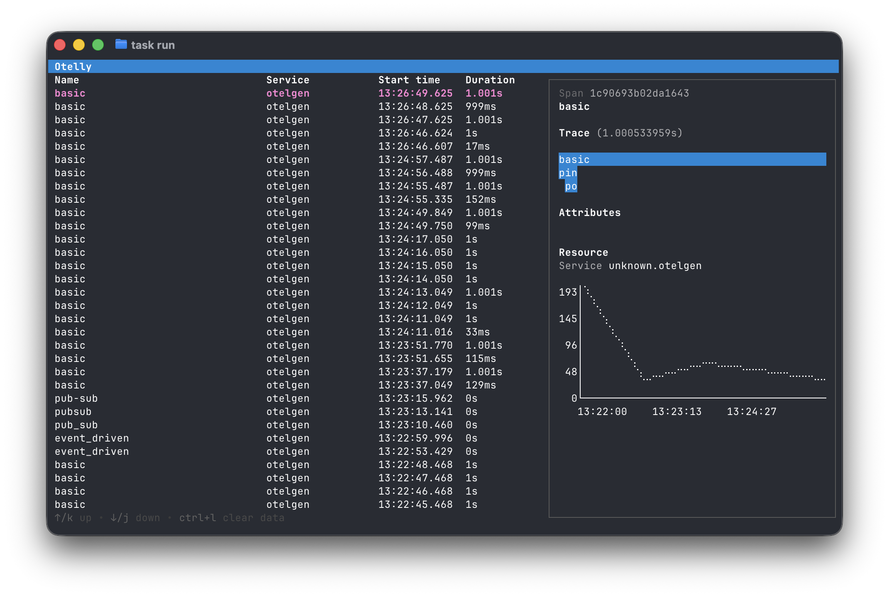
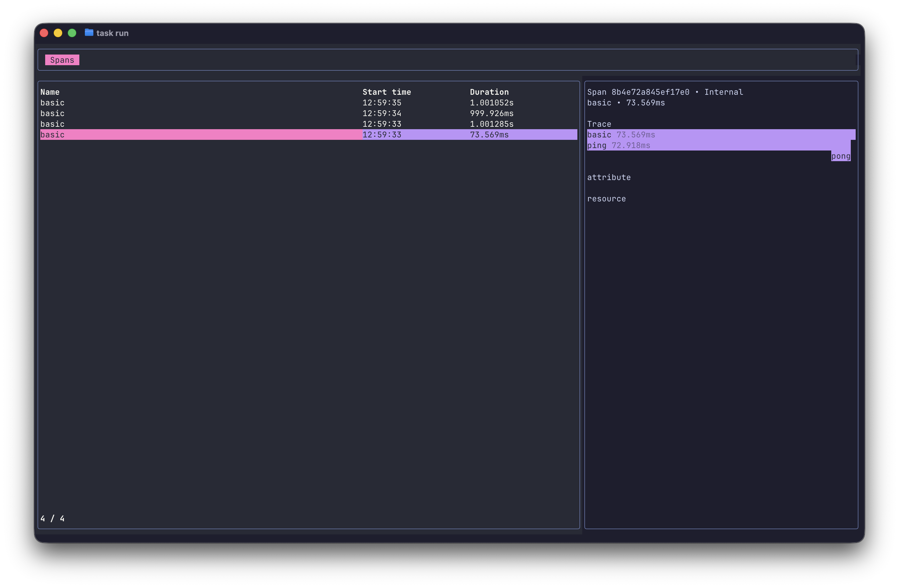

# Otelly

> [!WARNING]
> **Deprecated.** After dedicating some time to this I've come to the conclusion that I could create a better product, in less
> time using either a GUI framework, or web technologies. Maybe I'll come back to the topic of OpenTelmetry visualisation in
> the terminal in the future, but for now I'm going to focus my attention elsewhere.


*Main page from old (more feature complete) version.*


*Detail page from old (more feature complete) version. Showing the hierarchy of spans in a trace, and the waterfall view for each.*


*Main page from the new version. The colours didn't want to collaborate.*


[](https://github.com/FredrikAugust/otelly/actions/workflows/ci.yml) [](https://codecov.io/gh/FredrikAugust/otelly)

A TUI for viewing and debugging with OTEL signals locally.
Built with [bubbletea](https://github.com/charmbracelet/bubbletea),
[lipgloss](https://github.com/charmbracelet/lipgloss),
[Go OTEL SDK](https://opentelemetry.io/).

A lot of inspiration has been taken from
[otel-tui](https://github.com/ymtdzzz/otel-tui)
by [@ymtdzzz](https://github.com/ymtdzzz). You should check
out that project for a much more complete alternative to this. They've
done an amazing job.

## Usage

By running this project using `go run cmd/app/main.go` or `task run` a
collector will start listening on `0.0.0.0:4317` for OTLP gRPC
messages. It's also listening on HTTP on port 4318 with CORS
configured to allow all domains and all headers.

## Development

This project uses [Taskfile.dev](https://taskfile.dev) to simplify running commands.

If you want to install all deps on MacOS:

```bash
brew install krzko/tap/otelgen # just to seed with dummy data
brew install go-task
```

And then the different tasks:

```bash
task run               # Builds and runs the app
task debug             # Builds and runs the app for attaching debugger from neovim
task test              # Run tests
task ingest-dummy-data # Uses otelgen to send some data for testing
task logs              # Tail (follow) logs
```

Since the TUI takes up the main window, we write logs to `debug.log`.

During testing, to avoid having to re-seed my development environment all the time,
the application state is persisted to `local.db`. You can remove this to clear the
state. This will be changed before the first release so you can choose if you want
persistence or not.

## Features

**Spans**

- View all root spans (traces) on the front page
- View a summmary of the span's attributes and resource
- See a flamegraph of the trace's spans

### Future plans

- Add detail page for spans to see more information
- Filters and searching
- Metrics & Logs
- Add screenshots

## Contributions

Contributions are very welcome!

> [!NOTE]
> This projects is partially intended as a learning project, and as such use of
> AI is kept to a minimum.
> I consult it from time to time to brainstorm or fix my SQL queries, but an
> attempt is made to keep the
> project "hand made in Denmark" (other countries are encounraged to contribute).
